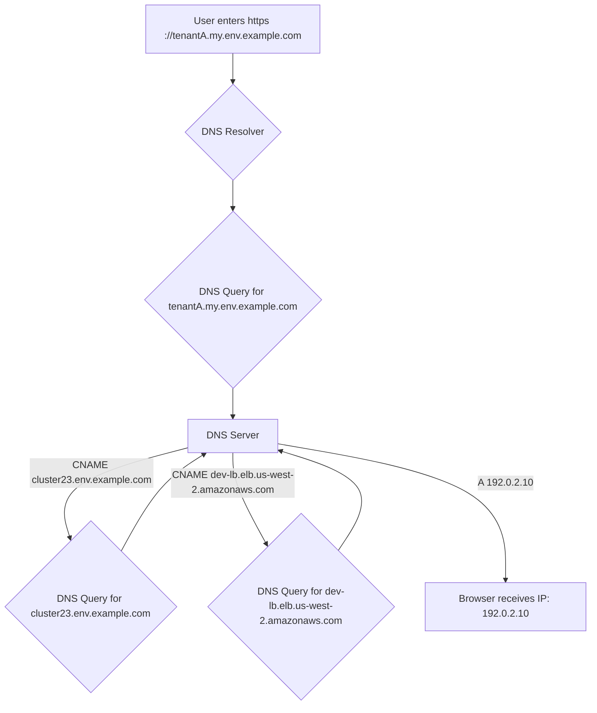
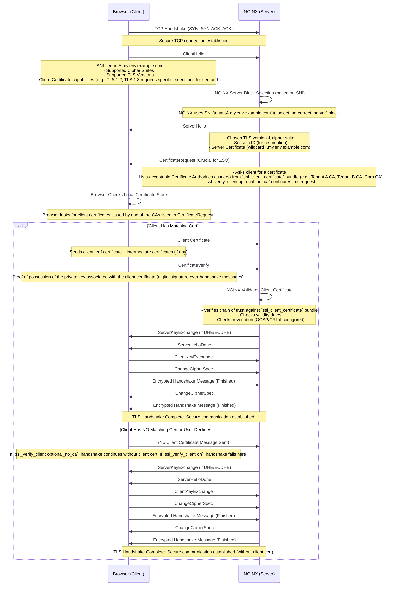

Yes, please combine both troubleshooting and a detailed TLS handshake diagram into a developer's deep-dive playbook. This will be an excellent addition to the comprehensive ZSO document.

Here's the expanded document, incorporating both requests.

-----

# Zero Sign-On (ZSO) in a Multi-Tenant Reverse Proxy Setup: Complete Deep Dive

This document is designed for engineers and architects who need to implement and troubleshoot ZSO in a multi-tenant environment. We will cover everything step by step, without skipping any details, including:

  * What ZSO is and why it matters
  * Detailed explanation of DNS, CNAME chains, SNI, and NGINX server block selection
  * TLS handshake phases relevant to ZSO
  * How client certificates are requested and validated
  * Multi-tenant CA bundle files: why and how
  * How backend services consume client certificates for ZSO
  * Edge cases, security considerations, and examples
  * **Troubleshooting Guide: A Developer's Deep-Dive Playbook**

## 1\. What is Zero Sign-On (ZSO)?

Zero Sign-On (ZSO) is a passwordless authentication mechanism where a user or a device proves its identity through a digital certificate rather than a username/password.

In ZSO:

1.  A client certificate (private key + public cert pair) is installed on the user's device.
2.  During the TLS handshake, the server requests this certificate.
3.  If the client presents a valid certificate from a trusted Certificate Authority (CA), the server authenticates them automatically.

**Benefit:**

  * No login prompt. Authentication happens at the TLS layer before the HTTP request even reaches the backend application. This enhances security and user experience.

## 2\. Why Multi-Tenant ZSO Is Complex

In a SaaS environment:

  * Each tenant can have its own PKI (Public Key Infrastructure) and CA.
  * Some tenants use internal corporate CAs.
  * Others use external providers.

Your reverse proxy must:

  * Accept client certificates from many different CAs.
  * Route the traffic based on the tenant's subdomain.
  * Pass the certificate information to the backend for ZSO.

## 3\. How a Request Travels Through the System: The Journey of a ZSO Request

Let's trace a request from the moment a user types a URL into their browser until the backend application receives it.

### 3.1 DNS Resolution

When a user enters a URL like `https://tenantA.my.env.example.com` into their browser, the first step is to resolve the hostname to an IP address.

**User enters:** `https://tenantA.my.env.example.com`

**`nslookup` might show:**

```
tenantA.my.env.example.com CNAME cluster23.env.example.com
cluster23.env.example.com CNAME dev-lb.elb.us-west-2.amazonaws.com
dev-lb.elb.us-west-2.amazonaws.com A 192.0.2.10
```

**Key points:**

  * DNS simply resolves names to an IP address. It's like looking up a phone number for a name.
  * The browser remembers the original hostname (`tenantA.my.env.example.com`) even after DNS resolution. This original hostname is crucial for the TLS handshake.

**Diagram: DNS Resolution Flow**



### 3.2 TCP Connection to the Load Balancer

Once the browser has the IP address (e.g., `192.0.2.10`), it initiates a TCP connection on port `443` (the standard port for HTTPS).

  * The browser opens a TCP connection to the IP of the load balancer on port `443`.
  * If using AWS, a Network Load Balancer (NLB) simply forwards packets to NGINX. Crucially, an NLB does *not* terminate TLS; it's a pass-through. This means NGINX sees the raw TLS traffic. NLB = Layer 4, raw speed, static IP, protocol-agnostic


### 3.3 TLS Handshake (Critical for ZSO)

The TLS handshake is where the magic of ZSO begins. This is a multi-step process where the client and server establish a secure communication channel and, in the case of ZSO, authenticate each other using certificates.

**Detailed TLS Handshake Diagram with ZSO Steps:**



#### 3.3.1 ClientHello

The browser initiates the TLS handshake by sending a `ClientHello` message. This message contains vital information for the server to set up the secure connection.

**Contents of ClientHello:**

  * **SNI (Server Name Indication):** `tenantA.my.env.example.com`. This is the original hostname the user entered. SNI allows the server to host multiple TLS-enabled websites on a single IP address.
  * **Cipher suites:** A list of cryptographic algorithms the client supports for encryption, hashing, and key exchange.
  * **Supported TLS versions:** E.g., TLS 1.2, TLS 1.3.

#### 3.3.2 ServerHello

NGINX receives the `ClientHello` and processes it.

  * **NGINX looks at the SNI:** Based on the `SNI` value (`tenantA.my.env.example.com`), NGINX selects the appropriate `server` block in its configuration. This is how it knows which server certificate to present and which client certificate policies to apply.

    ```nginx
    server {
        listen 443 ssl;
        server_name *.my.env.example.com; # Matches tenantA.my.env.example.com
        # ... other SSL configurations
    }
    ```

  * **Sends its server certificate chain:** NGINX sends its own server certificate (e.g., a wildcard certificate like `*.my.env.example.com`) to the browser. The browser uses this to verify the identity of the server. This comes from the `ssl_certificate` directive in NGINX.

  * **Sends a `CertificateRequest` (important for ZSO):** If configured for client certificate authentication, NGINX will send a `CertificateRequest` message as part of the `ServerHello` phase. This explicitly tells the client that the server is expecting a client certificate.

### 3.4 Server Certificate vs. Client Certificate

It's crucial to understand the difference between these two types of certificates in the TLS handshake:

  * **Server certificate:**
      * **Direction:** NGINX $\\rightarrow$ Browser
      * **Purpose:** Proves the identity of the server to the client.
      * **Source:** Configured via `ssl_certificate` and `ssl_certificate_key` in NGINX.
  * **Client certificate:**
      * **Direction:** Browser $\\rightarrow$ NGINX
      * **Purpose:** Proves the identity of the client (user or device) to the server. This is the core of ZSO.
      * **Triggered by:** `ssl_verify_client` directive in NGINX.

**ZSO focuses exclusively on client certificates.**

### 3.5 Requesting Client Certificates: NGINX Configuration

Certainly! Here’s a **rewritten, clear, and detailed explanation** of the NGINX configuration needed to request client certificates for Zero Sign-On (ZSO), along with a line-by-line breakdown of what each directive does and why it matters:

---

# 3.5 Requesting Client Certificates: NGINX Configuration for ZSO
- To enable ZSO, your NGINX `server` block must be configured to request client certificates.
- In other words, To enable Zero Sign-On (ZSO) using mutual TLS (mTLS), your NGINX server block must be configured to **request and validate client certificates during the TLS handshake**. This allows NGINX to authenticate users based on their client certificates issued by trusted Certificate Authorities (CAs).

```nginx
server {
    listen 443 ssl;
    server_name *.my.env.example.com;

    ssl_certificate /etc/nginx/certs/wildcard.my.env.example.com.crt;
    ssl_certificate_key /etc/nginx/private/wildcard.my.env.example.com.key;

    ssl_verify_client optional_no_ca;               # Request client certs but allow fallback
    ssl_client_certificate /etc/nginx/ca/tenant-ca-bundle.crt;  # Trusted multi-tenant CA bundle
    ssl_verify_depth 3;                              # Max depth of client cert chain to verify
}
```

---

### Explanation of each line:

#### `listen 443 ssl;`

* Configures NGINX to listen on port 443 with SSL/TLS enabled.
* TLS is mandatory for client certificate authentication (mTLS).
* Without TLS, client certificates cannot be exchanged.

---

#### `server_name *.my.env.example.com;`

* Accepts HTTPS requests for any subdomain under `my.env.example.com`.
* Supports multi-tenant setup where each tenant uses their own subdomain.

---

#### `ssl_certificate /etc/nginx/certs/wildcard.my.env.example.com.crt;`

#### `ssl_certificate_key /etc/nginx/private/wildcard.my.env.example.com.key;`

* Specifies the **server’s TLS certificate and private key**.
* These identify the server during the TLS handshake and establish a secure channel.
* Essential foundation — without these, TLS (and thus mTLS) cannot happen.

---

#### `ssl_verify_client optional_no_ca;`

* Requests a client certificate from the browser during the TLS handshake.
* `optional_no_ca` means:

  * If the client **provides** a valid certificate issued by a trusted CA, NGINX will authenticate it.
  * If the client **does not provide** a certificate, the handshake **still succeeds** (does not fail).
  * If the client provides an **invalid or untrusted** certificate, handshake still succeeds.
* This setting enables **graceful fallback** to other authentication methods (e.g., username/password) for clients without certs.
* Other options:

  * `on` — require a valid client certificate, handshake fails without one.
  * `off` — do not request a client certificate at all.

---

#### `ssl_client_certificate /etc/nginx/ca/tenant-ca-bundle.crt;`

* Points to a file containing a **concatenated list of trusted CA certificates** for all tenants.
* NGINX uses this CA bundle to:

  * **Send the list of trusted CAs** to clients during TLS handshake (CertificateRequest message).
  * **Validate the client certificate** presented by the browser against these trusted CAs.
* Crucial for multi-tenant ZSO, allowing a single NGINX instance to trust client certs issued by different tenant-specific CAs.

---

#### `ssl_verify_depth 3;`

* Defines the **maximum allowed depth** of the client certificate chain during verification.
* For example, depth of 3 supports:

  * Leaf client certificate (depth 0)
  * Intermediate CA (depth 1)
  * Root CA (depth 2)
* Setting this ensures NGINX can verify certificates with multiple intermediate CAs.

---

# Summary

This NGINX configuration enables the server to:

* Establish a **secure TLS connection** using its own certificate.
* **Request client certificates** during the TLS handshake but not reject clients lacking certs.
* **Validate client certificates** against a multi-tenant CA bundle.
* Allow **fallback authentication** when no valid client cert is presented.

This setup is foundational for implementing **Zero Sign-On (ZSO) using mTLS** in multi-tenant environments.

### 3.6 `CertificateRequest` Phase

When NGINX sends the `CertificateRequest` message, it includes a list of "acceptable CA distinguished names" (DNs). These are the subject DNs of the CAs whose certificates are present in the `ssl_client_certificate` bundle file.

The browser then inspects its local certificate store (e.g., Windows Certificate Manager, macOS Keychain, browser's own store):

  * If it finds a client certificate that was issued (signed) by one of the CAs in the list provided by NGINX, it may:
      * Automatically send it (common for machine/device certificates).
      * Prompt the user to choose from a list of matching certificates.
  * If no matching certificate is found (or the user declines), the browser sends no client certificate.

### 3.7 Client Certificate Sent

If a matching client certificate exists and the browser sends it:

  * **Client certificate chain:** The browser sends its leaf client certificate along with any intermediate CA certificates in its chain (up to, but not including, the root CA, which is typically trusted by the server already).
  * **Proof of possession of the private key (`CertificateVerify`):** The browser cryptographically proves that it possesses the private key corresponding to the public key in the client certificate. This is done by signing a hash of the handshake messages with its private key. This prevents an attacker from simply replaying a stolen client certificate.

### 3.8 Server Validates Client Certificate

Upon receiving the client certificate and `CertificateVerify` message, NGINX performs several crucial validation steps:

1.  **Chain of Trust:** NGINX verifies that the client certificate (and its chain) can be traced back to one of the trusted root or intermediate CAs specified in the `ssl_client_certificate` bundle.
2.  **Validity Dates:** Checks if the client certificate's validity period (Not Before / Not After dates) is current.
3.  **Revocation Status (if configured):**
      * If configured (e.g., via `ssl_crl` for Certificate Revocation Lists or `ssl_ocsp_stapling` for Online Certificate Status Protocol), NGINX will check if the client certificate has been revoked by the issuing CA.
4.  **Proof of Possession:** Verifies the `CertificateVerify` message's signature using the client certificate's public key.

**If verification fails and `ssl_verify_client` mode is:**

  * `on`: The TLS handshake fails immediately, and the connection is terminated.
  * `optional_no_ca`: The TLS handshake continues, but the outcome of the verification is recorded in the `$ssl_client_verify` NGINX variable, which will be `FAILED`. This allows the backend to decide how to handle the lack of a valid certificate.

### 3.9 After TLS: HTTP Request and NGINX Headers

Once the TLS handshake is successfully completed, the secure tunnel is established, and the HTTP request can now be sent encrypted over this tunnel.

**Example HTTP Request:**

```http
GET / HTTP/1.1
Host: tenantA.my.env.example.com
User-Agent: Mozilla/5.0 (...)
Accept: */*
```

NGINX, after performing its TLS duties, acts as a reverse proxy. For ZSO, it's crucial that NGINX extracts information from the client certificate and forwards it to the backend application. This is typically done by adding custom HTTP headers.

**NGINX adds headers (example configuration in `proxy_set_header` directives):**

```nginx
location / {
    proxy_pass http://backend_pool;
    proxy_set_header Host $host;
    proxy_set_header X-Real-IP $remote_addr;
    proxy_set_header X-Forwarded-For $proxy_add_x_forwarded_for;
    proxy_set_header X-Forwarded-Proto $scheme;

    # ZSO-specific headers
    proxy_set_header X-Client-Cert $ssl_client_escaped_cert;    # The full client certificate (PEM format, URL-escaped)
    proxy_set_header X-Client-Verify $ssl_client_verify;        # "SUCCESS" or "FAILED"
    proxy_set_header X-Client-Subject-DN $ssl_client_s_dn;      # Subject Distinguished Name of the client cert
    proxy_set_header X-Client-Issuer-DN $ssl_client_i_dn;       # Issuer Distinguished Name of the client cert
    proxy_set_header X-Client-Serial $ssl_client_serial;        # Serial number of the client cert
}
```

  * `X-Client-Cert`: Contains the entire client certificate in PEM format, but URL-escaped. The backend will need to URL-decode this before parsing it.
  * `X-Client-Verify`: This variable will be `SUCCESS` if the client certificate was validated against the `ssl_client_certificate` bundle and was not revoked (if revocation checks are enabled). It will be `FAILED` otherwise (e.g., untrusted issuer, expired, revoked, or invalid signature).
  * `X-Client-Subject-DN`: The Subject Distinguished Name of the client certificate (e.g., `/C=US/O=TenantA/CN=User1`). This is often used by the backend to identify the user or device.
  * `X-Client-Issuer-DN`: The Issuer Distinguished Name of the client certificate (i.e., the CA that signed it).
  * `X-Client-Serial`: The serial number of the client certificate, which can be used as a unique identifier.

## 4\. Multi-Tenant CA Bundle: The Backbone of ZSO

This is the critical enabler for accepting client certificates from multiple tenants.

### 4.1 Why a Bundle?

  * Each tenant might manage its own PKI and issue certificates from its own specific CA.
  * NGINX's `ssl_client_certificate` directive expects a *single* file.
  * Therefore, you cannot simply configure multiple `ssl_client_certificate` directives for each tenant's CA.
  * The solution is to concatenate all trusted root and intermediate CA certificates from all your tenants into one single file – the CA bundle.

### 4.2 Creating the Bundle

The bundle file is a simple concatenation of all your trusted CA certificates, typically in PEM format.

```bash
cat /path/to/tenantA-root-ca.crt \
    /path/to/tenantB-root-ca.crt \
    /path/to/corp-internal-ca.crt \
    > /etc/nginx/ca/tenant-ca-bundle.crt
```

**Important:** Only include the *public* certificates of your trusted CAs in this bundle. Never include private keys.

### 4.3 What Happens During Handshake with the Bundle?

When NGINX is configured with `ssl_client_certificate /etc/nginx/ca/tenant-ca-bundle.crt;`:

1.  **Acceptable Issuers List:** NGINX parses this bundle file at startup (or reload). It extracts the "Subject Distinguished Name" (DN) of each CA certificate found in the bundle. It then sends this combined list of acceptable issuer DNs to the client in the `CertificateRequest` message during the TLS handshake.
2.  **Client Certificate Validation:** When a client presents a client certificate, NGINX attempts to build a chain of trust from the presented client certificate up to one of the CAs in the `tenant-ca-bundle.crt`. If any part of the chain (leaf, intermediate, or root) matches a certificate in the bundle, and the chain validates (signatures, dates, revocation), then the client certificate is considered trusted.

### 4.4 Example Bundle File Contents

```
-----BEGIN CERTIFICATE-----
MIIF7TCCBNWgAwIBAgIUW6w... (Certificate for Tenant A Root CA) ...
-----END CERTIFICATE-----
-----BEGIN CERTIFICATE-----
MIIDzjCCApawgAwIBAgIUMp... (Certificate for Tenant B Root CA) ...
-----END CERTIFICATE-----
-----BEGIN CERTIFICATE-----
MIIDpDCCApwKgAwIBAgIQN4... (Certificate for Corporate Internal Root CA) ...
-----END CERTIFICATE-----
```

Each `-----BEGIN CERTIFICATE-----` block contains a separate CA certificate.

### 4.5 Dynamic Updates to the CA Bundle

In large, dynamic multi-tenant environments, the list of trusted CAs might change frequently as new tenants onboard or existing tenants update their PKI. Manually updating the `tenant-ca-bundle.crt` file and reloading NGINX can be cumbersome.

**Advanced Setup for Dynamic Updates:**

1.  **Centralized Storage:** Tenant CA certificates are stored in a centralized, secure database (e.g., AWS DynamoDB, a managed key-value store, or a secure object storage like S3).
2.  **Background Job/Service:** A dedicated service or a cron job periodically:
      * Queries the centralized storage to fetch all active tenant CA certificates.
      * Concatenates these certificates into a new `tenant-ca-bundle.crt` file in a temporary location.
      * Atomically replaces the old bundle file with the new one.
      * Triggers an NGINX reload (e.g., `nginx -s reload`). NGINX reloads its configuration without dropping active connections, ensuring near-zero downtime.

This automation ensures that NGINX always trusts the latest set of tenant CAs.

## 5\. Backend Application Processing: Consuming the Certificate

After NGINX successfully processes the client certificate and forwards the request, the backend application takes over.

### 5.1 Receiving Headers

The backend service receives the HTTP request with the custom headers added by NGINX:

  * `X-Client-Cert`: The URL-escaped PEM representation of the client certificate.
  * `X-Client-Verify`: `SUCCESS` or `FAILED`.
  * `X-Client-Subject-DN`: The Subject DN from the certificate.
  * `X-Client-Issuer-DN`: The Issuer DN from the certificate.
  * `X-Client-Serial`: The serial number.

### 5.2 Backend Validation and Identity Mapping

The backend application needs to:

1.  **URL-Decode the Certificate:**
    The `X-Client-Cert` header value is URL-escaped. The backend must decode it back to its raw PEM format.

2.  **Parse the Certificate:**
    Convert the PEM string into a certificate object (e.g., `X509Certificate2` in C\#, `crypto/x509` in Go, `PyOpenSSL` in Python, `java.security.cert.X509Certificate` in Java).

3.  **Validate the Certificate (Backend-side):**
    While NGINX performs initial validation, it's a security best practice for the backend to perform its own validation, especially:

      * Confirm `X-Client-Verify` is `SUCCESS`. If it's `FAILED`, the backend should reject the request or fall back to traditional authentication.
      * Verify the certificate's validity dates again.
      * Optionally, perform additional revocation checks (OCSP/CRL) if the backend has direct access to CA services.
      * Validate against an internal list of trusted CAs *if different from NGINX's bundle*, or to enforce stricter policies.

4.  **Map Certificate to User/Device Identity:**
    This is the core of ZSO on the backend. The backend uses attributes from the client certificate to identify the user or device. Common attributes used:

      * **Subject Distinguished Name (DN):** Often contains user-specific information (e.g., Common Name (CN), Organization (O)).
      * **Subject Alternative Name (SAN):** Can contain UPNs, email addresses, or custom identifiers.
      * **Serial Number:** Unique to each certificate.
      * **Thumbprint/Hash:** A unique hash of the certificate.

    The backend typically queries an identity store (e.g., LDAP, Active Directory, a custom user database) using one of these attributes to find a matching user or device entry.

5.  **Authorization:**
    Once the identity is established, the backend grants access based on the user's roles and permissions, without prompting for a username or password.

**Example (C\# Backend Logic):**

```csharp
using System.Net;
using System.Security.Cryptography.X509Certificates;
using System.Text;
using Microsoft.AspNetCore.Mvc;

[ApiController]
[Route("[controller]")]
public class DataController : ControllerBase
{
    [HttpGet]
    public IActionResult GetSensitiveData()
    {
        // 1. Get the X-Client-Cert header
        string rawClientCert = Request.Headers["X-Client-Cert"].FirstOrDefault();
        string clientVerifyStatus = Request.Headers["X-Client-Verify"].FirstOrDefault();

        if (string.IsNullOrEmpty(rawClientCert) || clientVerifyStatus != "SUCCESS")
        {
            // Fallback to traditional authentication (e.g., redirect to login page)
            // Or deny access if ZSO is strictly enforced
            return Unauthorized("Client certificate not provided or not verified.");
        }

        try
        {
            // 2. URL-Decode and parse the certificate
            string decodedCertPem = WebUtility.UrlDecode(rawClientCert);
            var clientCert = new X509Certificate2(Encoding.ASCII.GetBytes(decodedCertPem));

            // 3. Backend-side validation (optional but recommended for defense-in-depth)
            // Example: Additional policy checks, or checking against a different trust store
            // if (!MyCertValidator.IsValid(clientCert)) { return Unauthorized("Invalid certificate policy."); }

            // 4. Map the certificate to a user/device identity
            string userId = null;
            // Example 1: Using Subject Common Name (CN)
            var cn = clientCert.Subject.Replace("CN=", "").Split(',').FirstOrDefault();
            if (!string.IsNullOrEmpty(cn))
            {
                // Lookup user in your user database by Common Name
                // userId = _userService.GetUserByCommonName(cn);
                // For demonstration:
                userId = $"User from CN: {cn}";
            }

            // Example 2: Using Subject Alternative Name (SAN) - e.g., UPN
            foreach (var extension in clientCert.Extensions.OfType<X509Extension>())
            {
                if (extension.Oid.FriendlyName == "Subject Alternative Name")
                {
                    // Parse SAN for UPN or email
                    // This often requires more complex parsing depending on the SAN type
                    // For demonstration:
                    userId = $"{userId} / SAN: {extension.Format(false)}";
                }
            }

            // Example 3: Using certificate thumbprint (a unique hash of the cert)
            string thumbprint = clientCert.Thumbprint;
            // userId = _userService.GetUserByCertThumbprint(thumbprint);
            userId = $"{userId} / Thumbprint: {thumbprint}";

            if (string.IsNullOrEmpty(userId))
            {
                return Unauthorized("Could not map certificate to a known user.");
            }

            // 5. Grant access
            return Ok($"Welcome, {userId}! You have successfully authenticated via ZSO.");
        }
        catch (Exception ex)
        {
            // Log the exception
            return StatusCode(500, $"Error processing client certificate: {ex.Message}");
        }
    }
}
```

## 6\. Key Security Considerations

  * **Private keys never leave the client device:** The client's private key is generated and stored securely on the user's device (e.g., in a hardware security module, TPM, or secure enclave). It is *never* transmitted over the network. Only the public certificate and the cryptographic proof of possession are sent.
  * **Stolen certificates without keys are useless:** If an attacker obtains a client's public certificate but not the corresponding private key, they cannot impersonate the client because they cannot perform the `CertificateVerify` step.
  * **CAs in the bundle must be strictly controlled:** Only include the public certificates of CAs that you explicitly trust. Including an untrusted CA would allow anyone with a certificate issued by that untrusted CA to authenticate to your system. Regularly review and audit your `tenant-ca-bundle.crt`.
  * **Always log `$ssl_client_verify`:** Log the value of `$ssl_client_verify` in your NGINX access logs. This is invaluable for auditing and troubleshooting authentication failures.
  * **Defense in Depth:** While NGINX performs robust validation, consider additional validation steps in your backend application as a defense-in-depth measure. For example, check for specific certificate policies, OIDs, or additional revocation checks if your backend has access to more granular CA information.
  * **Certificate Revocation:** Implement robust Certificate Revocation List (CRL) or Online Certificate Status Protocol (OCSP) checking in NGINX or the backend. This is crucial for immediately invalidating compromised or lost client certificates. Without revocation checks, a compromised certificate could grant access until its expiration.

## 7\. Example End-to-End Flow Diagram

This diagram visualizes the entire journey of a ZSO request.

```mermaid
graph TD
    subgraph Client
        A[User Device: Browser, Client Cert + Key]
    end

    subgraph Network Layer
        B[DNS Resolution] --> C[Load Balancer (AWS NLB - Pass-through)]
    end

    subgraph Reverse Proxy (NGINX)
        D{NGINX Server}
        D -- SNI: tenantA.my.env.example.com --> E[NGINX Server Block Selection]
        E -- Configured with ssl_client_certificate --> F[Multi-Tenant CA Bundle]
        F -- List of Acceptable CAs --> G[TLS Handshake: CertificateRequest]
        G -- Server Cert + Request for Client Cert --> A
        A -- Client Cert + Proof of Key Possession --> D
        D -- Validates Client Cert against CA Bundle --> H{Client Cert Verified?}
    end

    subgraph Backend Application
        I[Backend Service (.NET, Java, etc.)]
    end

    A -- HTTPs Request --> C
    C -- Forwards Raw TCP --> D
    H -- YES (Client Cert Valid) --> J[NGINX adds Headers: X-Client-Cert, X-Client-Verify=SUCCESS, etc.]
    J --> I
    I -- Decodes & Parses Client Cert --> K[Backend validates Cert + maps to User/Device Identity]
    K -- ZSO Success! --> L[Access Granted to Application]

    H -- NO (Client Cert Invalid/Missing) --> M[NGINX adds Headers: X-Client-Cert=empty, X-Client-Verify=FAILED, etc.]
    M --> I
    I -- Backend detects no valid ZSO --> N[Fallback to Traditional Login / Deny Access]

    style C fill:#f9f,stroke:#333,stroke-width:2px
    style D fill:#f9f,stroke:#333,stroke-width:2px
    style I fill:#f9f,stroke:#333,stroke-width:2px
    style K fill:#ccf,stroke:#333,stroke-width:2px
    style L fill:#9f9,stroke:#333,stroke-width:2px
    style N fill:#f99,stroke:#333,stroke-width:2px
```

## 8\. FAQs

**Q: Does DNS CNAME affect server block selection?**
**A:** No. NGINX's server block selection is based on the Server Name Indication (SNI) sent in the `ClientHello` message during the TLS handshake. The SNI always contains the original hostname entered by the client (e.g., `tenantA.my.env.example.com`), regardless of any CNAME records in DNS.

**Q: Can I include multiple CA certs in one file for `ssl_client_certificate`?**
**A:** Yes, you *must*. NGINX expects a single file containing all trusted CA certificates concatenated together.

**Q: How does the browser know which client cert to send?**
**A:** The browser's behavior is driven by two main factors:

1.  **Acceptable Issuers List:** NGINX sends a list of acceptable CA distinguished names (extracted from your `ssl_client_certificate` bundle) in the `CertificateRequest` message.
2.  **Local Certificate Store:** The browser inspects its local certificate store. If it finds one or more client certificates that were issued by any of the CAs on NGINX's acceptable issuers list, it will:
      * Automatically select and send the most appropriate one (often if only one matches).
      * Prompt the user to choose from a list of matching certificates if multiple exist.

**Q: What if the user has no client certificate, or an invalid one?**
**A:**

  * **With `ssl_verify_client optional_no_ca`:** The TLS handshake will still succeed. NGINX will set the `$ssl_client_verify` variable to `FAILED` (or an empty string if no cert was presented). The backend application will receive this header and can then implement a fallback mechanism, such as redirecting to a traditional username/password login page, or providing a message that ZSO failed.
  * **With `ssl_verify_client on`:** The TLS handshake will fail immediately if no valid client certificate is presented. This is a stricter mode often used in environments where client certificates are mandatory for *all* access.

**Q: How does ZSO differ from MFA?**
**A:**

  * **ZSO (Zero Sign-On):** This is a *primary authentication mechanism* that uses device-bound certificates. It aims to eliminate the need for any login prompt whatsoever. The authentication happens silently at the TLS layer.
  * **MFA (Multi-Factor Authentication):** This refers to requiring *additional authentication factors* (e.g., a one-time password from an authenticator app, a fingerprint, a hardware token) *after* an initial primary authentication (which could be ZSO, or a traditional username/password login). While ZSO itself is a strong authentication factor, it can be combined with other factors (e.g., device posture checks) to achieve even higher security assurance, but typically doesn't involve *another explicit user interaction* like an OTP challenge after the certificate is presented.

## 9\. Troubleshooting Guide: A Developer's Deep-Dive Playbook

When ZSO isn't working as expected, it can be tricky to debug due to the low-level nature of TLS. Here's a systematic approach:

### 9.1 1. Verify NGINX Configuration

Always start by double-checking your NGINX configuration.

  * **`nginx -t`**: Run this command after any config changes. It checks for syntax errors.
    ```bash
    sudo nginx -t
    ```
    Expected output: `syntax is ok`, `test is successful`
  * **`ssl_verify_client`**: Ensure it's set to `optional_no_ca` or `on`.
    ```nginx
    ssl_verify_client optional_no_ca;
    ```
  * **`ssl_client_certificate`**: Confirm the path to your CA bundle is correct and the file exists.
    ```nginx
    ssl_client_certificate /etc/nginx/ca/tenant-ca-bundle.crt;
    ```
  * **`proxy_set_header`**: Make sure NGINX is configured to pass the client certificate information to the backend.
    ```nginx
    proxy_set_header X-Client-Cert $ssl_client_escaped_cert;
    proxy_set_header X-Client-Verify $ssl_client_verify;
    proxy_set_header X-Client-Subject-DN $ssl_client_s_dn;
    ```
  * **Permissions**: Ensure NGINX has read permissions on the CA bundle file and its containing directories.

### 9.2 2. Inspect NGINX Logs

NGINX access and error logs are invaluable.

  * **Access Log (`/var/log/nginx/access.log`):**
    Ensure you're logging the `$ssl_client_verify` variable.
    Example log format for ZSO troubleshooting:
    ```nginx
    log_format custom_zso '$remote_addr - $remote_user [$time_local] "$request" '
                         '$status $body_bytes_sent "$http_referer" '
                         '"$http_user_agent" "$http_x_forwarded_for" '
                         'ssl_client_verify:$ssl_client_verify '
                         'ssl_client_s_dn:"$ssl_client_s_dn" '
                         'ssl_client_i_dn:"$ssl_client_i_dn"';
    access_log /var/log/nginx/access.log custom_zso;
    ```
    Look for lines where `ssl_client_verify` is not `SUCCESS`. Common values:
      * `NONE`: Client did not present any certificate. (Expected if `optional_no_ca` and user has no cert)
      * `FAILED`: Client presented a cert, but it failed NGINX validation (e.g., untrusted issuer, expired, revoked, malformed).
      * `SUCCESS`: Client presented a valid and trusted certificate.
  * **Error Log (`/var/log/nginx/error.log`):**
    Increase log level to `info` or `debug` temporarily for more detailed TLS handshake messages.
    ```nginx
    error_log /var/log/nginx/error.log info; # or debug;
    ```
    Look for errors related to `ssl`, `client cert`, `handshake failed`.

### 9.3 3. Test with `openssl s_client` (The Developer's Best Friend)

`openssl s_client` is a powerful command-line tool for simulating TLS connections and debugging certificate issues.

**3.1. Test Server Certificate and Client Certificate Request:**

```bash
openssl s_client -connect tenantA.my.env.example.com:443 -servername tenantA.my.env.example.com
```

**What to look for in the output:**

  * **Server Certificate:** Check that NGINX is presenting the correct server certificate for your domain.
      * `Certificate chain:`
      * `Subject:` Should match your wildcard certificate (e.g., `CN = *.my.env.example.com`).
      * `Issuer:` The CA that issued your server cert.
  * **Client Certificate Request:** Look for the line `Client Certificate Types:` and `Cert chain and client cert` section. This indicates that NGINX is indeed requesting a client certificate.
      * `Acceptable client certificate CA names` will show the list of CAs from your `tenant-ca-bundle.crt`. If this list is empty or incorrect, your `ssl_client_certificate` bundle or its contents might be wrong.

**3.2. Test with a Specific Client Certificate:**

Use your actual client certificate and private key files for testing.

```bash
openssl s_client -connect tenantA.my.env.example.com:443 \
                 -servername tenantA.my.env.example.com \
                 -cert /path/to/my_client.crt \
                 -key /path/to/my_client.key \
                 -CAfile /etc/nginx/ca/tenant-ca-bundle.crt # Optional, but good for self-validation
```

**What to look for:**

  * **`Verify return code: 0 (ok)`:** This is the ideal outcome. It means the client certificate was successfully presented and validated by the server.
  * **`Client Certificate` section:** Verify that your client certificate is being sent and parsed correctly.
  * If `Verify return code` is something else (e.g., `21 (unable to verify the first certificate)`), it indicates a problem with the certificate chain or trust. This often means your `tenant-ca-bundle.crt` does not contain the necessary root or intermediate CA to validate your client certificate.

**Common `openssl s_client` errors and their meaning:**

  * `Verify return code: 21 (unable to verify the first certificate)`: The client certificate is not trusted by NGINX. The CA that issued the client certificate (or an intermediate CA in its chain) is not present or correctly formatted in your `tenant-ca-bundle.crt`.
  * `Verify return code: 10 (certificate has expired)`: The client certificate's validity dates are past.
  * `Verify return code: 27 (certificate not trusted)`: The client certificate (or its chain) is not signed by any of the CAs NGINX trusts.

### 9.4 4. Verify the Multi-Tenant CA Bundle

  * **File existence and readability:**
    ```bash
    ls -l /etc/nginx/ca/tenant-ca-bundle.crt
    sudo cat /etc/nginx/ca/tenant-ca-bundle.crt
    ```
  * **Correct format:** Ensure it's a concatenated series of PEM-encoded certificates, each starting with `-----BEGIN CERTIFICATE-----` and ending with `-----END CERTIFICATE-----`. No extra characters, no private keys.
  * **Content verification:** For each CA certificate in the bundle, you can examine its details:
    ```bash
    openssl x509 -in /etc/nginx/ca/tenant-ca-bundle.crt -noout -subject -issuer -serial -startdate -enddate
    ```
    This will print details for *all* certificates in the bundle. Verify that the `Subject` of your tenant CAs (the ones that issue client certs) are present and correct. NGINX uses these `Subject` DNs to build the `Acceptable client certificate CA names` list.

### 9.5 5. Browser/Client-Side Issues

  * **Client certificate installed?** Is the client certificate (and its private key) correctly installed in the user's browser or operating system's certificate store?
  * **Browser prompts:** Is the browser prompting the user to select a certificate? If so, is the correct certificate being chosen?
  * **Browser cache/state:** Sometimes, clearing browser cache or trying an incognito/private window helps rule out stale session data.
  * **Specific browser issues:** Different browsers handle client certificates slightly differently. Test with multiple browsers (Chrome, Firefox, Edge, Safari) if possible. Firefox has its own certificate store and might require importing the client certificate directly into its settings.

### 9.6 6. Backend Application Debugging

If `$ssl_client_verify` is `SUCCESS` in NGINX logs, but the backend isn't authenticating the user:

  * **Log raw headers:** Log the `X-Client-Cert`, `X-Client-Verify`, `X-Client-Subject-DN` headers *exactly as received by the backend*. This helps confirm NGINX is forwarding them correctly.
  * **URL Decoding:** Is the backend correctly URL-decoding the `X-Client-Cert` header? A common mistake is forgetting this step.
  * **Certificate Parsing:** Is the backend's code successfully parsing the PEM string into a usable certificate object?
  * **Backend Validation Logic:**
      * Is the backend checking for `X-Client-Verify == "SUCCESS"`?
      * Is its own certificate validation logic (if any) correct? Does it trust the same CAs as NGINX, or a subset/superset?
      * Are the validity dates being checked correctly?
      * Is the revocation status being checked?
  * **Identity Mapping Logic:** Is the backend correctly extracting the Subject DN, SAN, serial number, or thumbprint from the client certificate? Is its lookup logic against the user database correct? Does the extracted value match what's in your identity store?

By systematically going through these steps, from NGINX configuration to client-side behavior and backend processing, you can pinpoint the exact stage where the ZSO flow is failing.
